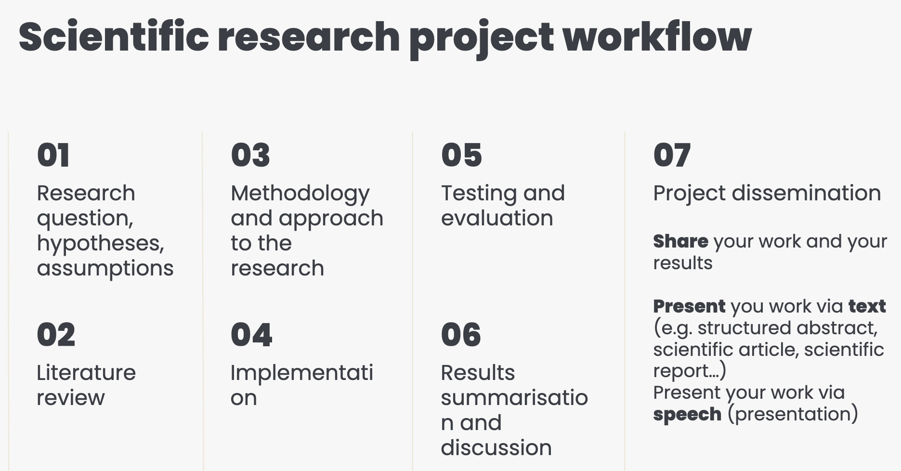
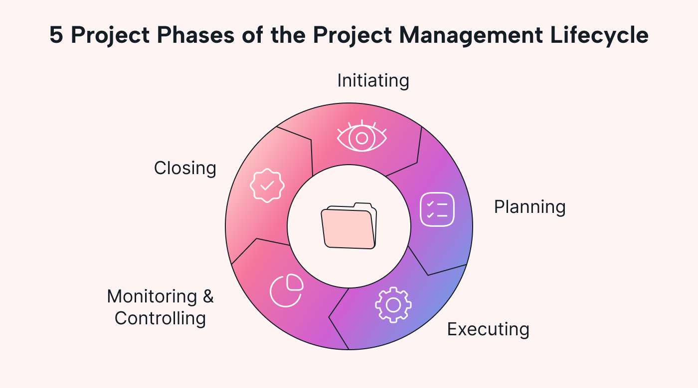

<!-- paginate: false -->

# DH Project Management & Tools for Research - Crash Course 
## DHDK 2nd year (2026/27)

[slide short url]()

---

# Practical stuff 

* 2 sessions, 4 hours. 
* Session 1 is Project Management, Session 2 is Tools for DH Research (Friday 12-2PM)
* Shared across both are the (complicated) topics of GenAI/LLMs and research/data literacy 
* Am available after each session (and later on too) if you need it
* Thank you if you took time to answer the [questionnaire](https://forms.cloud.microsoft/e/jSRc3WbGH3) (it's still open!)

<!-- 
- The sessions are interconnected, best if you can attend/follow/catch up on both as there's a fair amount of crossover
- We'll discuss what we can in the time we have 
- There's an hour after each session before the lab is occupied again so if needed I'm happy to hang around and discuss anything you may want to
-->

--- 

# A quick intro and ice-breaker 

* 💼 My background is in media and culture, in particular music.
* 🎓 DHDK 2022 graduate. 
* 💻 Work within the /DH.arc center, currently as a DH specialist for an EU-funded project on analog oral history. 
* 🤞🏻 I offer these courses because I believe that sharing learnings can help make your own experience of the course better. 
* 🤔 This course is a first, and a bit of an experiment so any feedback you have at the end is appreciated. 

--- 

# A quick intro and ice-breaker 

ICE BREAKER HERE -> past / existing professional experiences / interest which then leads us to can these be replaced by AI 

---
<!-- _class: impact -->

# Inevitable choice? 
## AI and its implications 

--- 

<!-- _class: steps -->
<!-- _footer: Bonnie Stewart, DPI 2026 Keynote https://uwaterloo.ca/digital-pedagogy-institute/keynotes. "Want to Fight Back Against Big Tech? Start Here." Tressie McMillan Cottom. Aug 03, 2026. https://www.nytimes.com/2026/08/03/opinion/artificial-intelligence-data-politics.html  -->

# What are we talking about? 

* Artificial Intelligence means different things to different people in different contexts: Generative AI, LLMs, Machine Learning, the business of AI etc... 

* What matters yet is often 'unsaid' is that AI as it is used today in media and society implies a political theory, what Tressie McMillan Cottom calls data politics. 

* > "[...] The technology isn't just large language models or agents or data centers. It is the backbone of a superstructure that merges regressive politics with unchecked economic power in the guise of technological innovation." 

<!-- 
- The words we use matter. Think about what you are implying when you use a specific term. 
-->

--- 
<!-- _class: steps -->

# What does it do to us? 

* Generative AI is a tool of cognitive offloading.

* It is impacting already weakened educational and cognitive foundations. Previous and similar technological leaps are often the cause of these weakenings (e.g. internet, social media).

* GenAI is good at doing. If you decide to use it, you must (at least) remain in control of what is worth doing with it, and why? 

<!-- 
- Another way to look at this is that while GenAI does simplify things, if you choose to use it so, it also complicates others, whether that be your own learning or the need to manage it.  
-->

--- 
<!-- _class: steps -->

# What does it cost us? 

* A lot. The ethical implications are many and intertwined, from environmental resources to training sources to access. 

* Unlike previous problematic, and similarly inevitable, technologies fostered by the internet (AirBnB, Uber, Amazon etc) GenAI feels somehow heavier. 

* In all these cases though, the implications of the choice are forced upon you by structural systems e.g. data politics. 

* Develop habits of ethics and critical approach: do not simply accept that you must use this technology because x, y, z. 

<!-- 
- It's one thing to wave away the implications of having something delivered to you the next day. It's another waving away the implications of generating images, audio, video, or text with a few lines of text in seconds. The immediacy of it feeds the burden. 
-->

--- 
<!-- _class: steps -->

# Is there a choice?

* Yes. None of this is inevitable. 

* Institutional support isn't great (sorry) and things are moving so fast that choosing not to use GenAI can feel like choosing to play the game in very hard mode. And there's no extra life. 

* > "Being pro AI does not mean being uncritical about what we're building and where the industry is heading." - Tobi Ajala 

* > "It is possible to learn about this technology without using it." - Casey Fiesler 

--- 

# Further reading, watching, and thinking... 

1) [Last year's list of references (most are still relevant)]()
2) Some Instagram accounts worth checking out @kingavriel @hannesbajohr @tobitobetoby @professorcasey @centerfordemocraticai 
3) [Training The Archive project](https://trainingthearchive.ludwigforum.de/en/start/)  
4) [Language Machines: Cultural AI and the End of Remainder Humanism](https://www.upress.umn.edu/9781517919320/language-machines/) by Leif Weatherby 
5) [Deep Unlearning: The Rise of AI and the Radicalization of a Tech Idealist](https://www.versobooks.com/products/3381-deep-unlearning) by Timnit Gebru (forthcoming later this year )

---
<!-- _class: impact -->

# Project Management  
## aka getting things done 
## (and hopefully on time and within budget) 

<!-- 
- What we'll cover on this topic today assumes a degree of basic familiarity with Project Management, based on some of your feedback via the questionnaire. 
-->

--- 

# Different Contexts, Different Approaches 

<figure>

<figcaption>DH Project Management first year crash course 2025</figcaption>
</figure>

In the first crash course you were given a look at Project Management within the context of scientific research. 

For reference: [DH Project Management first year crash course 2025](https://figshare.com/articles/presentation/_b_DH_Project_Management_part_I_-_DHDK_Crash_Courses_2023_b_/24249829?file=58604407)

--- 

# Different Contexts, Different Approaches 

Today we'll instead take a more generic look at the subject, based on the standard PM phases as they're used in a working environment and then how some of those broader aspects of PM can apply in the context of your studies. 

<figure>

<figcaption>Source: https://www.usemotion.com/blog/project-phases</figcaption>
</figure>

--- 

# Project Management elements 

If we take the five steps as shown in the previous slide as the baseline, I like to breakdown what PM involves under the following 'elements': 
* Planning
* Time 
* Budget
* Resources 
* Collaboration & Communication 
* Documentation & Monitoring

These apply broadly to the concept of a project, regardless of its context. The context will however dictate how you might value them, refine them, order them etc. 

--- 
<!-- _class: steps -->

# Planning 

* Easily taken for granted, but also easily the source of problems down the road. 

* Depending on the context, it offers space for being creative, for putting down big ideas that can then be refined or constrained based on the reality of the project. 

* The key question: <mark>what are you doing? </mark>

* The things the plan needs to either answer or provide a framework for is <mark>everything else</mark>, from how you will do something to how you will evaluate it. 

* It doesn't have to be set in stone from the start, but if you've included it you're less likely to be caught out. 

<!-- 
- It's totally normal to make mistakes at the planning stage, to forget something, or get it wrong. No plan is perfect, it's having it and learning through doing it over and over that matters.  
-->

--- 

