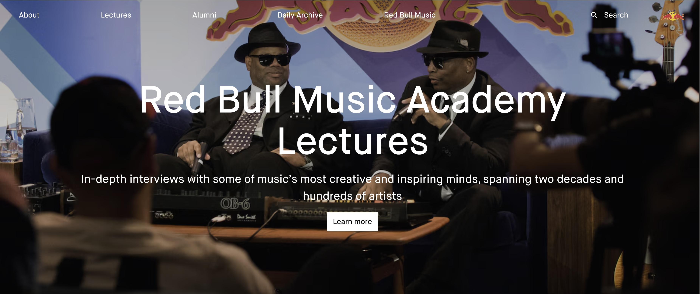

<!-- paginate: false -->

# DH Project Management & Tools for Research - Crash Course 
## DHDK 2nd year (2026/27)

September 23 & 25, 2026
Laurent Fintoni
laurent.fintoni2@unibo.it 
[GitHub](https://github.com/laurentfintoni/dhdk-crash-courses/tree/2026-27_2nd_year)

---

# Practical stuff 

* 2 sessions, 4 hours. 
* Session 1 is Project Management, Session 2 is Tools for DH Research (Friday 12-2PM)
* Shared across both are the (complicated) topics of GenAI/LLMs and research/data literacy 
* Am available after each session (and later on too) if you need it
* Thank you if you took time to answer the [questionnaire](https://forms.cloud.microsoft/e/jSRc3WbGH3) (it's still open!)

<!-- 
- The sessions are interconnected, best if you can attend/follow/catch up on both as there's a fair amount of crossover
- We'll discuss what we can in the time we have 
- There's an hour after each session before the lab is occupied again so if needed I'm happy to hang around and discuss anything you may want to
-->

--- 

# A quick intro and ice-breaker 

* 💼 My background is in media and culture, in particular music.
* 🎓 DHDK 2022 graduate. 
* 💻 Work within the /DH.arc center, currently as a DH specialist for an EU-funded project on analog oral history. 
* 🤞🏻 I offer these courses because I believe that sharing learnings can help make your own experience of the course better. 
* 🤔 This course for 2nd year students is a first, and a bit of an experiment so any feedback you have at the end is appreciated. 

--- 

# A quick intro and ice-breaker 

ICE BREAKER HERE -> past / existing professional experiences / interest which then leads us to can these be replaced by AI 

---
<!-- _class: impact -->

# Inevitable choice? 
## AI and its implications 

--- 

<!-- _class: steps -->
<!-- _footer: Bonnie Stewart, DPI 2026 Keynote https://uwaterloo.ca/digital-pedagogy-institute/keynotes. "Want to Fight Back Against Big Tech? Start Here." Tressie McMillan Cottom. Aug 03, 2026. https://www.nytimes.com/2026/08/03/opinion/artificial-intelligence-data-politics.html.  -->

# What are we talking about? 

* Artificial Intelligence <mark>means different things to different people in different contexts</mark>: Generative AI, LLMs, Machine Learning, the business of AI etc... 

* What matters yet is often 'unsaid' is that AI as it is used today in media and society implies a political theory, what Tressie McMillan Cottom calls <mark>data politics</mark>. 

* > "[...] The technology isn't just large language models or agents or data centers. It is the backbone of a superstructure that merges regressive politics with unchecked economic power in the guise of technological innovation." 

<!-- 
- The words we use matter. Think about what you are implying when you use a specific term. 
-->

--- 
<!-- _footer: Dr. Avriel Epps, Instagram, Sept. 18, 2026. https://www.instagram.com/reels/DdaE-7nCnON/.  -->
<!-- _class: steps -->

# What are we talking about?  

* Debating whether or not a technology is good or bad in the abstract is not useful.

* What's more useful is to think about <mark>how technology functions under specific social, political, and economic conditions</mark>. 

* > "Right now the question about AI is not a question about technology, it is a question about power." - Dr. Avriel Epps 

* In a DH context, this approach can help you figure out how and why you want to use and study the technology (or not). 

--- 
<!-- _class: steps -->

# What does it do to us? 

* Generative AI is <mark>a tool of cognitive offloading</mark>.

* It is impacting already weakened educational and cognitive foundations. Previous and similar technological leaps are often the cause of these weakenings (e.g. internet, social media).

* GenAI is 'good' at doing. If you decide to use it, <mark>you must (at least) remain in control of what is worth doing with it, and why?</mark> 

<!-- 
- Another way to look at this is that while GenAI does simplify things, if you choose to use it so, it also complicates others, whether that be your own learning or the need to manage it.  
-->

--- 
<!-- _class: steps -->

# What does it cost us? 

* A lot. The <mark>ethical implications are many and intertwined</mark>, from environmental resources to training sources to access. 

* Unlike previous problematic, and similarly inevitable, technologies fostered by the internet (AirBnB, Uber, Amazon etc) GenAI feels somehow heavier. 

* In all these cases though, the implications of the choice are forced upon you by structural systems e.g. data politics. 

* Develop <mark>habits of ethical and critical thinking</mark>: do not simply accept that you must use this technology because x, y, z. 

<!-- 
- It's one thing to wave away the implications of having something delivered to you the next day. It's another waving away the implications of generating images, audio, video, or text with a few lines of text in seconds. The immediacy of it feeds the burden. 
-->

--- 
<!-- _class: steps -->
<!-- _footer: Who's Responsible for "Responsible AI"? Mystery AI Hype Theater 3000. July 06, 2026. https://www.buzzsprout.com/2126417/episodes/19595620-who-s-responsible-for-responsible-ai-2026-07-06. -->

# What does it cost us? 

* The other thing about cost is related to <mark>the convenience that is being sold under the guise of AI</mark>. This is relevant in a DH context because a lot of what GenAI/LLMs can make more convenient is work that is often seen as tedious or boring. 

* In these situations it's important that you remain aware of <mark>what is being offloaded, what that might cost you</mark>, and how you may want to balance it out. 

* > "It's like you're short-cutting yourself. You're taking away from the work. It's a lot of work. It's boring even. But then you arrive at the thing, and that's the process." - sava saheli singh

<!-- 
- While it may feel counterintuitive, a lot of what is deemed tedious or boring work things like literature review, data cleaning, virtual enviroment setups, boilerplate code, etc...  is often just as important and can lead to crucial insights that feed other parts of the work. 
-->

--- 
<!-- _class: steps -->
<!-- _footer: Tobi Ajala, Instagram, Sept. 14, 2026. https://www.instagram.com/reel/DdQ1UkioL29/. Casey Fiesler, Instagram, Aug. 21, 2026. https://www.instagram.com/reel/DcT8NGsq5hD/?stkn=Z3d4MGozZGQ3ZDJs.  -->

# Is there a choice?

* Yes. <mark>None of this is inevitable.</mark> 

* Institutional support isn't great (sorry) and things are moving so fast that choosing not to use GenAI can feel like choosing to play the game in very hard mode. And there's no extra life. 

* > "Being pro AI does not mean being uncritical about what we're building and where the industry is heading." - Tobi Ajala 

* > "It is possible to learn about this technology without using it." - Casey Fiesler 

--- 

# Further reading, watching, and thinking... 

- [Last year's list of references (most are still relevant)]()
- Some Instagram accounts worth checking out @kingavriel @hannesbajohr @tobitobetoby @professorcasey @centerfordemocraticai 
- [Training The Archive project](https://trainingthearchive.ludwigforum.de/en/start/)  
- [Language Machines: Cultural AI and the End of Remainder Humanism](https://www.upress.umn.edu/9781517919320/language-machines/) by Leif Weatherby 
- [Deep Unlearning: The Rise of AI and the Radicalization of a Tech Idealist](https://www.versobooks.com/products/3381-deep-unlearning) by Timnit Gebru (forthcoming later this year )
- [Unibo GenAI policy](https://www.unibo.it/en/university/statute-standards-strategies-and-reports/artificial-intelligence)

---
<!-- _class: impact -->

# Project Management  
## aka getting things done 
## (and hopefully on time and within budget) 

<!-- 
- What we'll cover on this topic today assumes a degree of basic familiarity with Project Management, based on some of your feedback via the questionnaire. 
-->

--- 

# Different Contexts, Different Approaches 

<figure>

<figcaption>DH Project Management first year crash course 2025</figcaption>
</figure>

In the first crash course you were given a look at Project Management within the context of scientific research. 

For reference: [DH Project Management first year crash course 2025](https://figshare.com/articles/presentation/_b_DH_Project_Management_part_I_-_DHDK_Crash_Courses_2023_b_/24249829?file=58604407)

--- 

# Different Contexts, Different Approaches 

Today we'll instead take a more generic look at the subject, based on the standard PM phases as they're used in a working environment and then how some of those broader aspects of PM can apply in the context of your studies. 

<figure>

<figcaption>Source: https://www.usemotion.com/blog/project-phases</figcaption>
</figure>

--- 

# Project Management elements 

If we take the five phases as shown in the previous slide as the baseline, I like to breakdown what PM involves under the following 'elements': 
* Planning 
* Time 
* Budget 
* Resources 
* Collaboration & Communication 
* Documentation & Monitoring

These apply broadly to the concept of a project, regardless of its context. <mark>The context will however dictate how you might value them, refine them, order them etc.</mark> 

--- 
<!-- _class: steps -->

# Planning 

* Easily taken for granted, but also <mark>easily the source of problems down the road</mark>. 

* Depending on the context, it offers space for being creative, for putting down big ideas that can then be refined or constrained based on the reality of the project. 

* The key question: <mark>what are you doing?</mark>

* A plan needs to at least provide a framework for <mark>everything else in the project</mark>, from how you will do something to how you will evaluate it.   

* It doesn't have to be set in stone from the start, but if you've included it you're less likely to be caught out. 

<!-- 
- It's totally normal to make mistakes at the planning stage, to forget something, or get it wrong. No plan is perfect, it's having it and learning through doing it over and over that matters. It's a way of laying out all the questions you have, and if you can already include answers great, otherwise at least you know you need that answer. 
-->

--- 
<!-- _class: steps -->

# Time

* A <mark>finite resource</mark>. Often crucial for the executing phase.

* But also a malleable resource. You can move things around to allow for time lost or gained. 

* Can be <mark>difficult to meaningfully measure/monitor</mark>, especially in the context of studies, though finding systems that work for you can be useful. At the very least you should try and keep a log of work done. 

* My advice: when you plan, allocate more time than you think is needed for a task so that you can stay flexible. If you gained time, great. If you lost time, you have already accounted for it. 

--- 
<!-- _class: steps -->

# Budget 

* Another finite resource. Also quite hard to come by. 

* In the context of your studies, this is <mark>less about money and more about time</mark>. 

* In the real world, a budget <mark>most directly impacts the resources available to execute the project</mark>, be it people or things. 

* A good exercise is to always remember that even for a study project your resources are not infinite. So if you're interested in budgeting, try and apply it to your studies in terms of the time a person takes to do the work (most often calculated using the concept of [person-month](https://ec.europa.eu/newsroom/just/items/643967)). 

<!-- 
- I'll show you some real world budgets in a bit, so you can get a sense of what time and budget mean practicaly. 
-->

--- 
<!-- _class: steps -->

# Resources

* A project requires <mark>different types of resources, most of which are interconnected</mark>: people, time, money, tools, physical or virtual spaces etc... Again, these are finite. 

* These <mark>come into play at every phase</mark>. So best not to underestimate their importance. 

* In a DH context, most often we're talking about people and tools (and the time and money needed for them). 

* It's good practice to list all your needed resources at the initiating / planning phases especially so that you can account for things like training or access. 

--- 
<!-- _class: steps -->

# Collaboration & Communication 

* Another element that is found at every phase of a project. 

* Certain tools are useful for this, especially as projects now tend to be spread out across different physical places. 

* However, <mark>no tool can replace or approximate the experience of being physically present and together</mark>. Communication is physical. 

* My advice: <mark>Communicate often. Collaborate as needed</mark>. 

* Look into different decision-making approaches, find the one that fits the project. 

* It's a <mark>constant learning process</mark>. It can also be the most rewarding aspect of a project. 

<!-- 
- Slack, Notion, Discord, Zoom, shared calendars, Trello, Figma, etc.
- Sometimes it's better for one person to take something on rather than collaborate, as long as they communicate what is happening to others. 
- Consensus can be useful but sometimes there's also the need for someone to be 'in charge'. 
-->

--- 
<!-- _class: steps -->

# Documentation & Monitoring

* Feels 'boring'. In reality, it's the most important aside from resources. 

* <mark>Document as much as you can</mark>. That is how you show what you did and how. And it is how you get money to do things. 

* Errors happen. <mark>Documenting them allows for the lessons to be shared with everyone else</mark>. 

* Monitoring is one aspect of documentation, allowing you to <mark>measure if your plan is working</mark>: do we have enough time left? Are we on track for milestone x? Do we need to change a certain aspect of what's being done because the target has shifted? And so on... 

* Good documentation and monitoring allows your project to stay flexible. 

--- 
<!-- _class: steps -->

# Q&A break 

SOMETHING

--- 
<!-- _class: steps -->

# Practical examples: RBMA 

<figure>

<figcaption>[RBMA](https://www.redbullmusicacademy.com/lectures/)</figcaption>
</figure>

In the first crash course you were given a look at Project Management within the context of scientific research. 

For reference: [DH Project Management first year crash course 2025](https://figshare.com/articles/presentation/_b_DH_Project_Management_part_I_-_DHDK_Crash_Courses_2023_b_/24249829?file=58604407)

