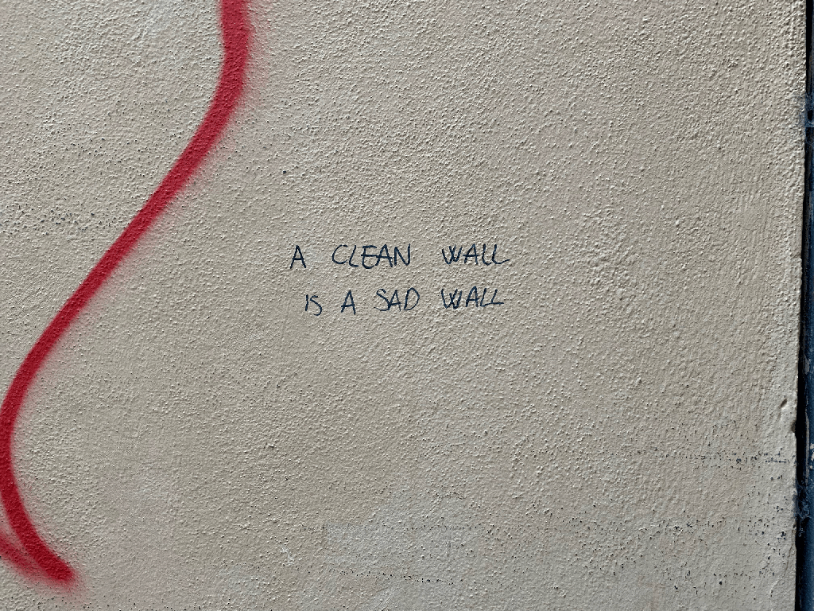
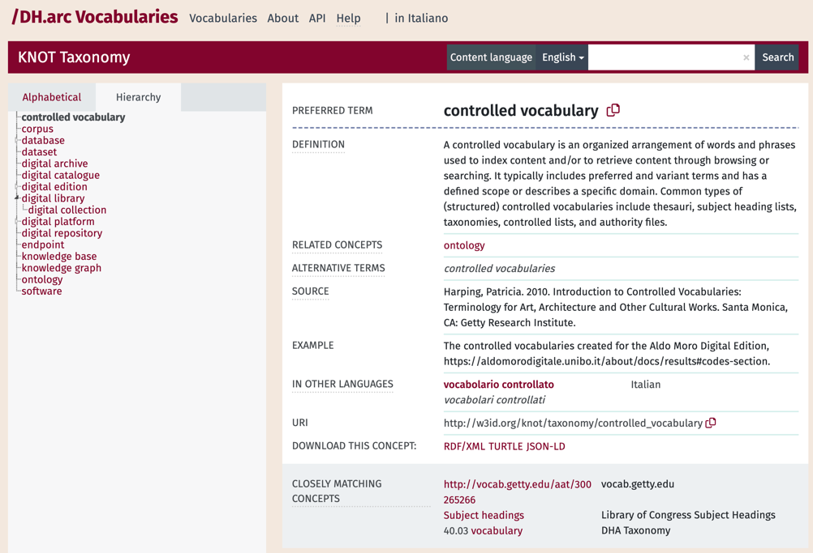
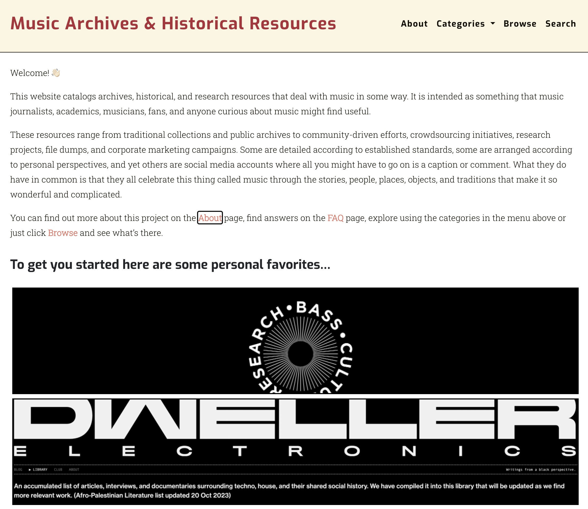
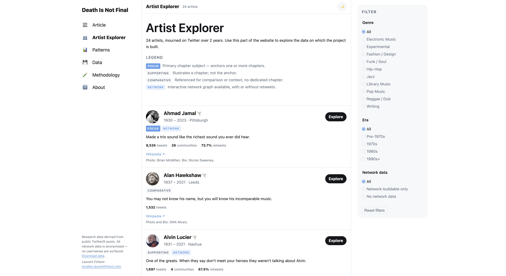
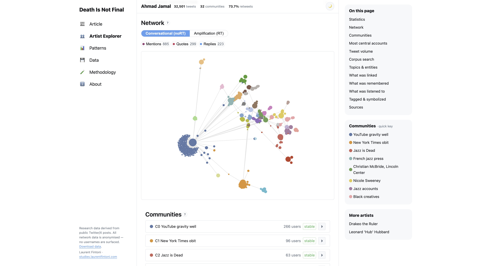

<!-- paginate: false -->

# DH Project Management & Tools for Research - Crash Course 
## DHDK 2nd year (2026/27)

September 25, 2026
Laurent Fintoni
laurent.fintoni2@unibo.it 
[GitHub](https://github.com/laurentfintoni/dhdk-crash-courses/tree/2026-27_2nd_year)

---

# Practical stuff 

* This is Session 2, focused on Tools & Literacy for DH Research. 
* Session 1 materials + recordings are on [GitHub](https://github.com/laurentfintoni/dhdk-crash-courses/tree/2026-27_2nd_year)/in your email. 
* Shared across both are the (complicated) topics of GenAI/LLMs and research/data literacy. 
* Thank you if you took time to answer the [questionnaire](https://forms.cloud.microsoft/e/jSRc3WbGH3) (it's still open!)

--- 

<!-- _class: impact -->

# Search against the machine
## GenAI, Search Engines, and Information Literacy

<!-- 
- So first up is an update on SEs, and how things have changed since last year, most notably in terms of how GenAI and LLMs have permeated so many aspects of what used to be traditional search functions online. 
-->

--- 

<!-- _class: steps -->
<!-- _footer: '"August 2026 Google algorithm and search industry updates". September 09, 2026. https://www.impressiondigital.com/blog/august-2026-google-algorithm-and-search-industry-updates/. '  -->

# Google is no longer a Search Engine? 

* As of August 2026, <mark>Google is now prioritising AI summaries</mark> (powered by its Gemini family of LLMs) over traditional link results. 

* This move is lending weight to the argument that Google is moving away from its historical position as a Search Engine. 

* You are no longer querying and then sifting through an index of results to evaluate them for your needs. A process that was already under threat from sponsored results and SEO manipulation.  

* <mark>You are instead being told what an answer is, and must evaluate its validity and usefulness</mark>. 

<!-- 
- If this shift holds, this is likely to be an important moment in the history of the internet and digital information literacy. 
- It's also important to remember that AI summaries in Google are being added to the already existing sponsored results and semantic results it was prioritising before this latest switch. So traditional results are now fighting against multiple other commercially-driven interests. 
-->

--- 
<!-- _class: steps -->
<!-- _footer: 'Tressie McMillan Cottom, Instagram, Aug. 3, 2026. https://www.instagram.com/p/Dbl8-8eGsrl/. Shiri Melumad, Jin Ho Yun, Experimental evidence of the effects of large language models versus web search on depth of learning, PNAS Nexus, Volume 4, Issue 10, October 2025, pgaf316, https://doi.org/10.1093/pnasnexus/pgaf316'  -->

# LLMs are Search Engines? 

* This shift is primarily driven by the rise of GenAI and LLMs as supposedly essential tools for our present moment. 

* The implications for research literacy are many, starting with the fact that in addition to existing (re)search and data literacy skills <mark>you now need to develop AI literacy</mark>. 

* To be clear: <mark>LLMs are not Search Engines</mark>, but they are sold to us as such because it benefits the business of AI (see Tressie McMillan Cottom's [data politics argument](https://www.instagram.com/p/Dbl8-8eGsrl/)).

* You must remain aware of what is being sacrificed by relying on LLMs to do the work of (re)searching information and summarizing it. As well as its real-world costs, such as energy consumption. 

<!-- 
- AI literacy has different threads, in this particular context I'm referring to the need to understand how an AI summary is produced, what it lacks, what it costs, what it hides, etc... 
- The costs of an AI-assisted search are still being understood but we know that the cognitive impacts are real. 
-->

--- 
<!-- _footer: 'AI Literacy Is Information Literacy: Helping Students Navigate a New Research Landscape. EBSCO. https://about.ebsco.com/blogs/ebscopost/ai-literacy-information-literacy-helping-students-navigate-new-research-landscape'  -->

# AI Literacy 

So what does AI literacy mean? 

1) Evaluating how information is retrieved & organized 
2) Assessing accuracy, bias and credibility of AI outputs
3) Understanding the ethical use of AI-generated content
4) Reflecting on how AI influences decision-making

Existing literacy frameworks (like the [ALA](https://www.ala.org/acrl/standards/ilframework)) are often applicable to how AI is transforming the finding and processing of information. New AI-first frameworks are appearing, such as the recent [AILit Framework](https://ailiteracyframework.org/) from the EU. 

<!-- 
- If there is time/interest, show the example of the EBSCO source being unconfirmable. 
-->

--- 
<!-- _class: steps -->
<!-- _footer: ''  -->

# AI Literacy 

* But what if you don't want to use AI? 

* You can opt-out. 

* <mark>It is not an easy choice, but it is a choice you can make</mark>. 

* It's a choice that should be informed, so it still best that you to learn about the technology.  

* See the slides for session 1 and bibliography for more on what GenAI and LLMs mean for all of us beyond a new technology or potential tool. 

<!-- 
- Currently missing from a lot of frameworks and discussions about what it means to learn or work with AI is a seemingly obvious part of the argument: what about those who don't want to? 
-->

--- 
<!-- _class: steps -->
<!-- _footer: '"Top 10 Non Ai Search Engine Options for 2026". Surnex. https://surnex.io/blog/non-ai-search-engine.' -->

# You can still search 

* It's more difficult on the surface. GenAI assistance is increasingly added to everything online. 

* Old Google parameters are your friend: [https://udm14.org/](https://udm14.org/).

* As are SEs designed for privacy like DuckDuckGo, Brave, and Mojeek. Most have optional AI-powered services that can be turned off. Here's an [overview of current options](https://surnex.io/blog/non-ai-search-engine) (ironically from a company that sells AI visibility services). 

* Domain-specific SEs such as [Google Scholar](https://scholar.google.com/) and [The Internet Archive](http://archive.org/) currently remain AI-free (at least on the surface for Google products). 

---
<!-- _class: steps -->
<!-- _footer: '"Google users are less likely to click on links when an AI summary appears in the results". Athena Chapekis and Anna Lieb. Pew Reserch Center. https://www.pewresearch.org/short-reads/2025/07/22/google-users-are-less-likely-to-click-on-links-when-an-ai-summary-appears-in-the-results/. "32.7% of EU people used generative AI tools in 2025". Eurostat. https://ec.europa.eu/eurostat/web/products-eurostat-news/w/ddn-20251216-3. "64% of 16-24-year-olds used AI in 2025". Eurostat. https://ec.europa.eu/eurostat/web/products-eurostat-news/w/edn-20260210-1' -->

# Practical implications  

* Research on the impact of GenAI on information literacy and searching exists, though it moves 'slower' than the technology. 

* On the US side, Pew Research studies point to <mark>AI summaries reducing time spent looking at sources or clicking further into external sites</mark>. 

* On the EU side, an average of <mark>32.7% people aged 16-74</mark> used GenAI compared to <mark>64% of 16-24-year-olds</mark> in 2025. 

* Across most studies you'll find some key points repeat: <mark>diminished cognitive load, platform capture, generational splits</mark>. 

---

# Quick check-in 

Any questions? Thoughts?  

---
<!-- _class: impact -->

# DH Research Tools  
## and examples of building things 

<!-- 
- What we'll cover on this topic today assumes a degree of basic familiarity with tools and project-based work, based on some of your feedback via the questionnaire. 
-->

--- 
<!-- _class: steps -->
<!-- _footer: 'TaDiRAH The Taxonomy of Digital Research Activities in the Humanities. https://tadirah.info/pages/Browser.html' -->

# Refresh on categories 

* In the first year crash course I offered some categories for DH research tools, in terms of what they can help you accomplish. 

* These include: Text/Content Analysis; Annotation; Visualisation, Storytelling, Mapping; Network Analysis; Content Management, Web Development; Knowledge Organisation; Coding, Programming; Data Collecting, Cleaning, Processing. 

* In terms of activities these categories cover things like: interrogating data; manipulating data; contextualising data; preparing, distributing, presenting data; classifying data; etc... 

* A useful source when wondering what research activities you want to do is the TaDiRAH taxonomy (here in the footer, also in your bib). 

<!-- 
- These categories and activities are not exhaustive, but intended as top level. You can get more granular, which Tadirah does. 
-->
---
<!-- _class: steps -->
<!-- _footer: 'TaDiRAH The Taxonomy of Digital Research Activities in the Humanities. https://tadirah.info/pages/Browser.html' -->

# A note on tools  

* Tools can mean different things! 

* A programming language or code library can be a tool. As can a specifically built piece of software that allows you to run code without touching a line of it. 

* <mark>What ultimately matters most is your level of comfort with a tool</mark> (whatever it may be) and whether or not it is helping you do the thing you are trying to do. 

* <mark>Experimenting with tools is also a good habit</mark>, you sometimes need to try in order to know that something ain't it for you (like me and JavaScript). 

* All this is also more relevant as LLMs are now presented as another tool for DH practitioners to use. 

---
<!-- _class: steps -->

# Practical examples: Walls of Bologna 

<figure>

<figcaption><a href="https://studies.laurentfintoni.com/walls-bologna/" class="href" target="_blank">i muri non finisco mai</a></figcaption>
</figure>

* A mapping project for the 2nd year Laboratory course in 2022. 
* Goal: Build a digital object using different techniques and tools learnt during the course. 

--- 
<!-- _class: steps -->

# Practical examples: Walls of Bologna 

* Tools: Python scripts to extract GPS and metadata from images; Google sheets and .csv files for data cleaning & management; Photoshop for image automation; JS libraries for mapping; HTML and CSS for the non-map part of the website. 

* The scripts came from existing examples. The mapping came from a textbook. The photos and ideas came from my day to day life in Bologna during COVID, and previous experiences. 

* I borrowed from lab sessions on digital history and storytelling, a conference I attended (where I got the idea of vernacular memory from), and some second year electives on critical thinking around place and language. 

--- 
<!-- _class: steps -->

# Practical examples: Walls of Bologna 

* As I put these slides together I noticed the map now required an API key to access the tiles. The site was still usable but looked clearly 'broken'. 

* This is a useful reminder that long-term preservation of a digital project/object is a meaningful choice you should always be aware of. <mark>Build things but don't let them rot.</mark> 

* In this case, the website relies heavily on external services: Google (for the data) and various map data providers for the tiles.

* <mark>Minimising a project's reliance on external services is the best way to ensure it is easier to maintain long-term</mark>. 

--- 
<!-- _class: steps -->

# Practical examples: DH.arc Vocabularies  

<figure>

<figcaption><a href="https://lab.dharc.unibo.it/skosmos/en/" class="href" target="_blank">DH.arc Vocabularies</a>.</figcaption>
</figure>

* A repository for semantic artefacts (ontologies, vocabularies) created by DH.arc. 
* Goal: build a repo for these artefacts that can be used by others and is easily maintainable. 

--- 
<!-- _class: steps -->

# Practical examples: DH.arc Vocabularies 

* This was an offshoot of my [previous research position](https://icdp-digital-library.github.io/KNOT/). I created some controlled vocabularies and needed to make them available to comply with FAIR principles. 

* Inspired by a [similar DH project](https://vocabs.dariah.eu/en/) I decided to replicate their approach using the same underlying infrastructure, [Skosmos](https://github.com/natlibfi/skosmos), which is open source. 

* To get around some 'complicated' infrastructural requirements I decided to try and run Skosmos using [Docker](https://www.docker.com/), which allows you to run software by packaging it into standalone containers. 

* It took about six months to get it all working as intended, and it has been live for a year. The entire process is [documented on GitHub](https://github.com/dharc-org/dharc-vocab?tab=contributing-ov-file). Maintenance is attached to my employment. 

* <mark>Docker is quite popular and an interesting tool</mark>. It allows you to use software that may otherwise require specific infrastructure you don't have access to. 

---

<!-- _class: steps -->

# Practical examples: MJI  

<figure>

<figcaption><a href="https://studies.laurentfintoni.com/mji/" class="href" target="_blank">Music Journalism Insider</a>.</figcaption>
</figure>

* A catalogue of archival and historical resources related to music. 
* Goal: transform a Google Doc into a web-based catalogue to transition one project to another. 

--- 

<!-- _class: steps -->

# Practical examples: MJI 

* Personal project, loosely connected to my DHDK thesis. Between 2020 and 2023, a friend and I maintained a [Google Doc](https://docs.google.com/document/d/1n6YzY38xxPs8Uz2dNxPQgSPQTWODBfxckLueVgcb-ds/edit?tab=t.0) for his newsletter, aimed at music journalists. 

* When he decided to end the newsletter I wanted the work we'd done to live on. I looked at existing projects for inspiration. In this case [Rutger's MusicDH](https://rutgersdh.github.io/musicdh/) catalogue. 

* MusicDH used a minimal computing framework for online exhibitions called [minicomp/wax](https://github.com/minicomp/wax/), which proved simple enough to reuse. It also allowed me to explore how to use Ruby to build and run web-based 'apps'. 

* Aside from minicomp/wax, the project reuses other skills and tools: Photoshop automations for images; HTML/CSS for design; csv-based database; controlled vocabularies; programming basics for using Ruby and adapting the template.    

---

<!-- _class: steps -->

# Using tools, building things 

* The three projects I've shared with you were all created without GenAI. I can maintain them without it too, and have so far done so with the exception of using it to figure out some specific code tweaks in PHP and JS, two languages I struggle with. 

* <mark>Documentation and use of open-source tools allow others to understand how things are built and potentially use it themselves</mark>. That is how I build most of my projects. 

* The different skills you learn in this course can be combined if you figure out which skill sits along which research need for you. 

* The tools do not need to be complicated. <mark>Building something that is infrastructurally small and manually-maintained but resilient is just as valuable as building a fancy application with 1000s of lines of code and various automations</mark>. 

---

# Quick check-in (again)

Any questions? Thoughts?  

---
<!-- _class: impact -->

# Building & researching with the machine  
## Some examples of LLM uses 

--- 
<!-- _class: steps -->

# DH Research and GenAI 

* The following examples are my own personal experiences, not endorsements of using GenAI (or specific products) in your work/research. 

* It is incredibly important to understand that these uses do not resolve the ethical implications that come with GenAI usage. I choose to do this for personal and research reasons, but I am conflicted about it. 

* Research around GenAI use in the DH is sparse right now, but I've included the most relevant examples I could find in the bib. 

---
<!-- _class: steps -->

# Gemini (LM) Notebook  

* RAG-based tool from Google. Requires paid-access to be truly useful (like all these tools). I believe Unibo accounts have a one-year base pro access. 

* Pretty good for literature reviews. Feed it a set of documents (papers, reports etc) on one topic and then query them via its interface. I find it useful to get an overview of certain topics as well as summarise existing best practices. 

* The deep research function can be useful to start from scratch, and some of the functionalities can be useful for learning purposes esp. if you have some specific learning needs. 

* It does hallucinate in my experience. Another issue is that you can't easily export the outputs of its various tools, keeping you locked inside the platform/UI. 

---
<!-- _class: steps -->

# Claude, AI Agents, Personal KBs  

* I use Anthropic's Claude service with a pro subscription (covered by my current project's funds). 

* I was a late comer to agent-based GenAI usage but was convinced to try it earlier this year after a non-techie friend shared some of his experiences. 

* It can be useful. It remains problematic.  

* These are commercial products with a barrier to access (can you afford it?) and unknown availability (no one knows if any of these companies will exist next year). Open-source alternatives still rely on models created by commercial entities, still require you to pay to play. 

---
<!-- _class: steps -->

# Claude, AI Agents, Personal KBs  

* I think one of the more interesting uses of a service like Claude is in how it can help you build personal, local Knowledge Bases (KBs). 

* Doing this requires at least a pro subscription and some plugins, as well as being comfortable with the terminal (command line interface, or CLI). 

* I currently use a plugin called [context-mode](https://github.com/mksglu/context-mode), which works with most agent platforms. This does a few things: minimizes token usage & context loss, and lets you create project-specific KBs with markdown documents or code.

* I find this particularly useful to track not just code but also documentation - remembering becomes a process of querying the KB and finding the document you need. 

---
<!-- _class: steps -->

# Claude, AI Agents, Personal KBs  

* I now use Claude 99% of the time through Claude Code (rather than Desktop or VSCode plugin), via the terminal. Interfaces and applications are ultimately a personal choice. 

* I use Claude Code for both coding and non-coding work: organization, documentation, ideating, search/exploration of topics.  

* <mark>Whatever time it 'saves' me on one thing, it creates additional work elsewhere</mark>: summaries of literature still need evaluating; code needs reviewing in some way; documentation needs to be checked. And ultimately, <mark>the agent itself needs to be managed</mark> (token usage, project context, how to 'speak with it', prompting etc). It's another thing I have to think about. 

* After about six months of regular usage (around 25% of my working time) I find that not using it is just as important. If you choose to use it, finding a balance is key. 

---
<!-- _class: steps -->

# Practical examples: Death on Twitter 

* The most useful practical example I can give you of using something like Claude in a DH project context is an ongoing experiment I am running. 

* This involves revisiting the data I used as the basis for the [paper](https://github.com/laurentfintoni/musicians-death) I submitted for the 2nd year Network Analysis course. 

* That paper was a study of social media mourning on Twitter related to musicians, conducted with Gephi. 

* The new project is an attempt at redoing this work with a different approach: writing a data journalism piece and building a data exploration tool to go with it using Claude. 

* The project is not finished so I cannot share any links for those not attending. But if you are interested you can contact me and I'd be happy to show you. 

---
<!-- _class: steps -->

# Practical examples: Death on Twitter   

<figure>

<figcaption>Rebuilding Twitter datasets with a Twitter-inspired UI. Claude Code wrote the code, I supervised it.</figcaption>
</figure>

<figure>

<figcaption>Redoing network analysis with a different approach: Python instead of Gephi; textual analysis of corpus; close reading of data.</figcaption>
</figure>

--- 

<!-- _class: cover -->

# Thank you! 

Slides & bibliography https://github.com/laurentfintoni/dhdk-crash-courses/tree/2026-27_2nd_year 

Questions etc... laurent.fintoni2@unibo.it 